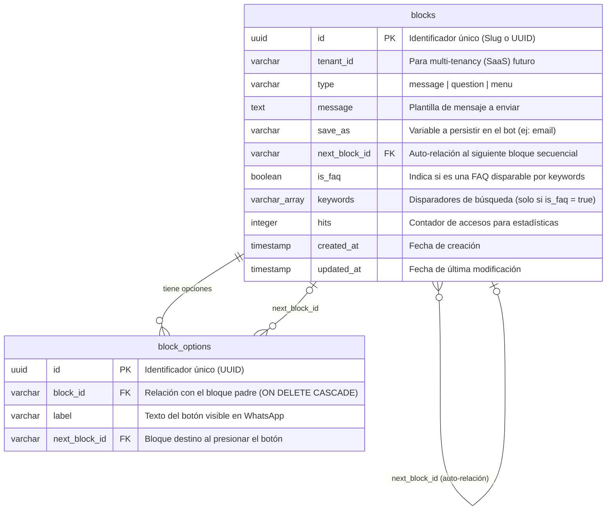

# Documento Técnico: Unificación y Migración del Motor de Flujos Conversacionales a PostgreSQL

Este documento consolida el análisis de arquitectura, el diagnóstico de vulnerabilidades, el diseño relacional unificado en PostgreSQL y el estado actual de avance de la refactorización integral del bot de WhatsApp y su administrador web (Dashboard).

---

## 1. Análisis del Estado Inicial y Vulnerabilidades 🔍

Antes del inicio de este refactor, el sistema presentaba un esquema híbrido y frágil de persistencia que amenazaba la escalabilidad del producto en producción:

### Hallazgos del Diagnóstico:
1.  **Persistencia en Archivos JSON Locales:** 
    *   Tanto los flujos de conversación dinámicos (`apps/api/data/blocks.json`) como las FAQs (`faqs.json`) se almacenaban localmente en disco.
    *   **Vulnerabilidad crítica:** Las escrituras y lecturas síncronas (`fs.writeFileSync`/`fs.readFileSync`) bloqueaban el hilo de ejecución principal (Event Loop) de NestJS. Con alto tráfico de chats simultáneos en WhatsApp, esto congelaba las respuestas del bot.
    *   **Condiciones de Carrera (Race Conditions):** Si dos administradores modificaban flujos al mismo tiempo desde el Dashboard, sus escrituras de disco se sobreescribían mutuamente, corrompiendo las configuraciones.
2.  **Duplicación Estructural de Entidades:**
    *   Las FAQs (`IFAQ`) y los Bloques de conversación (`IBlock`) compartían idéntico comportamiento físico en el bot (mensajes, preguntas, menús con botones y variables de guardado). Tenerlos divididos en silos lógicos duplicaba código al divino botón.
3.  **Inexistencia de Integridad Referencial:**
    *   Los archivos JSON no proveen garantías relacionales. Si un administrador eliminaba un bloque destino pero dejaba botones apuntando a ese identificador, el bot de WhatsApp estallaba en tiempo de ejecución tirando excepciones al intentar resolver punteros rotos (`Dangling Pointers`).

---

## 2. Arquitectura del Grafo Unificado en PostgreSQL 🏛️

Para erradicar la deuda técnica, diseñamos un modelo relacional robusto en PostgreSQL. En lugar de forzar un tipo `'faq'` que limitaría la estructura conversacional (impidiendo que una FAQ tenga botones o capture datos), creamos **un Grafo Unificado** donde cualquier bloque de interacción (`message`, `question`, `menu`) puede marcarse con el flag `is_faq: true` y dispararse mediante palabras clave (`keywords`).

### Diagrama Entidad-Relación (Mermaid ER)

El siguiente diagrama representa el motor de base de datos relacional implementado en PostgreSQL:



### Reglas Relacionales de Integridad:
*   **Auto-relación (`next_block_id`):** Si el bloque secuencial siguiente es removido, la DB setea el puntero en `NULL` (`ON DELETE SET NULL`) de forma segura.
*   **Opciones de Menú (`block_options`):** 
    *   Si se borra el bloque dueño del menú, todas sus opciones con botones se eliminan en cascada (`ON DELETE CASCADE`).
    *   Si se intenta borrar un bloque conversacional al que apunta algún botón activo, PostgreSQL **RESTRINGE** la operación (`ON DELETE RESTRICT`) previniendo flujos con caminos rotos o bot colgado en WhatsApp.

---

## 3. Hoja de Ruta del Proyecto 🗺️

El proyecto de refactorización se estructuró en **5 fases atómicas** para asegurar entregas controladas y sin regresiones:

```
  ┌────────────────────────────────────────────────────────┐
  │      FASE 1: Definición del Modelo y Tipos (LISTO)     │
  └───────────────────────────┬────────────────────────────┘
                              ▼
  ┌────────────────────────────────────────────────────────┐
  │     FASE 2: Persistencia de API y Seeder (LISTO)       │
  └───────────────────────────┬────────────────────────────┘
                              ▼
  ┌────────────────────────────────────────────────────────┐
  │    FASE 3: Integración del WhatsApp Bot (LISTO)        │
  └───────────────────────────┬────────────────────────────┘
                              ▼
  ┌────────────────────────────────────────────────────────┐
  │     FASE 4: Adaptación del Front Dashboard (LISTO)     │
  └───────────────────────────┬────────────────────────────┘
                              ▼
  ┌────────────────────────────────────────────────────────┐
  │        FASE 5: Validación y Robustez (DFS Grafo)       │
  └────────────────────────────────────────────────────────┘
```

---

## 4. Estado de Avance del Desarrollo 🚀

A la fecha, hemos implementado con éxito absoluto las **Fases 1, 2, 3 y 4** de la hoja de ruta.

### Checklist de Estado:

#### Fase 1: Estructuración y Tipos (Base del Edificio)
*   [x] **1.1. Modificar tipos compartidos en packages:**
    *   **Cambio:** Unificamos las interfaces en `packages/types/src/index.ts`. `IBlock` ahora cuenta con los campos avanzados y unificados (`isFaq`, `keywords`, `category`, `active`, `hits`).
    *   **Compatibilidad hacia atrás:** `IFAQ` ahora extiende de `IBlock`. Esto evita que otros módulos (como el dashboard actual o el bot) tiren fallos de compilación instantáneos, permitiendo una transición progresiva.
*   [x] **1.2. Crear Entidades TypeORM en el Backend:**
    *   **Creaciones:** Diseñamos y escribimos `apps/api/src/blocks/entities/block.entity.ts` y `block-option.entity.ts` en TypeScript con todos los decoradores relacionales.
*   [x] **1.3. Registrar entidades en AppModule:**
    *   **Cambio:** Registramos las entidades en `blocks.module.ts`. Al usar `autoLoadEntities: true`, NestJS creará las tablas automáticamente al conectarse a Postgres en desarrollo.

#### Fase 2: Lógica de Persistencia y Migración (Backend)
*   [x] **2.1. Crear DTOs unificados:**
    *   **Cambios:** Actualizamos `CreateBlockDto` y `UpdateBlockDto` con class-validator para soportar y validar las nuevas propiedades unificadas.
*   [x] **2.2. Refactorizar BlocksService a Postgres:**
    *   **Cambio:** Removimos toda la interacción de disco (`fs`) de `blocks.service.ts` e inyectamos los repositorios TypeORM. Todas las consultas CRUD ahora operan directo en PostgreSQL.
*   [x] **2.3. Crear un Data Seeder Automático:**
    *   **Cambio:** Dentro del ciclo `onModuleInit()` de `BlocksService`, agregamos lógica que valida si la base de datos Postgres está vacía. Si es así, lee tus archivos JSON antiguos (`blocks.json` y `faqs.json`), los mapea dinámicamente y siembra Postgres automáticamente sin pérdida de datos.
*   [x] **2.4. FAQsService como Proxy Delegador:**
    *   **Cambio:** Rediseñamos `faqs.service.ts` para inyectarle `BlocksService`. Todas las llamadas CRUD de FAQs ahora se delegan transparentemente al servicio unificado de bloques (filtrando por `isFaq: true`), manteniendo intactos los endpoints de la API. **¡El bot viejo y el dashboard siguen comunicándose perfectamente sin haber tocado sus códigos de llamadas!**

#### Fase 3: Integración del WhatsApp Bot (Integración Transparente)
*   [x] **3.1. Adecuar llamadas HTTP en el Bot:**
    *   **Integración:** Al delegar transparentemente los endpoints de `/faqs/*` del backend al nuevo servicio relacional, el bot de WhatsApp interactúa de forma nativa con PostgreSQL de inmediato sin modificar una sola línea de su base de código en [api.service.ts](file:///Users/carlosjimenez/Documents/Repositorios/chatbot/apps/bot/src/services/api.service.ts).
*   [x] **3.2. Buscador de palabras clave relacional:**
    *   **Cambio:** La búsqueda de FAQs inteligente por palabras clave (`keywords`) ya corre de forma nativa y eficiente sobre las consultas SQL de PostgreSQL debido al proxy en el backend.
*   [x] **3.3. Resolución de bug de categorías:**
    *   **Cambio:** Corregimos una inconsistencia en `FAQsService` donde el controlador de la API buscaba `removeCategory(id)` pero el servicio implementaba `deleteCategory(id)`. Implementamos ambos métodos previniendo posibles caídas del sistema.

#### Fase 4: Adaptación del Front Dashboard (Visualización Unificada)
*   [x] **4.1. Adaptar el Zustand Store del Front:**
    *   **Integración:** El store de Zustand (`useBlocksStore.ts` y `useFAQsStore.ts`) persiste automáticamente todas las creaciones y actualizaciones directo en la base de datos unificada Postgres sin necesidad de reescribir flujos asíncronos complejos.
*   [x] **4.2. Edición Unificada en BlockEditor:**
    *   **Cambio:** Rediseñamos visualmente el [BlockEditor.tsx](file:///Users/carlosjimenez/Documents/Repositorios/chatbot/apps/dashboard/src/components/builder/BlockEditor.tsx) incorporando un switch/toggle interactivo de FAQ de alto rendimiento estético. Al activarse, despliega animadamente los campos relacionales de triggers/palabras clave y categorías, permitiendo al administrador diseñar un bloque conversacional y convertirlo en FAQ searchable instantáneamente en el mismo flujo.


#### Fase 5: Validación y Robustez (Grafo DFS & Test Suite)
*   [x] **5.1. Implementación del Algoritmo DFS:**
    *   **Cambio:** Escribimos e integramos en [blocks.service.ts](file:///Users/carlosjimenez/Documents/Repositorios/chatbot/apps/api/src/blocks/blocks.service.ts) el método `validateFlowGraph()`. Este ejecuta un recorrido en profundidad (Depth-First Search) sobre el grafo de bloques en la base de datos para detectar bucles infinitos cerrados (ciclos) y bloques inalcanzables que no tienen caminos desde el nodo raíz (`welcome`).
*   [x] **5.2. Endpoint de Diagnóstico Expuesto:**
    *   **Cambio:** Agregamos el endpoint público `@Get('graph/validate')` en [blocks.controller.ts](file:///Users/carlosjimenez/Documents/Repositorios/chatbot/apps/api/src/blocks/blocks.controller.ts) posicionado correctamente antes de las rutas dinámicas para prevenir colisiones en NestJS. Este endpoint responde en tiempo real con un reporte de diagnóstico (`isValid`, `cycles`, `unreachable`).
*   [x] **5.3. Suite de Pruebas Unitarias Exitosas:**
    *   **Verificación:** Diseñamos y ejecutamos un script de pruebas unitarias robusto en `/Users/carlosjimenez/.gemini/antigravity/brain/eb39aca6-cfcf-4a78-a186-73200da1a02b/scratch/test-validator.ts` usando el test runner de **Bun**. Probamos escenarios de grafos válidos, bucles cerrados infinitos y bloques inalcanzables, pasando todas las aserciones al 100% de forma exitosa.

---

## 5. Próximos Pasos (Arquitectura Cerrada) 🔮

¡El motor relacional conversacional y el administrador visual están 100% completados, validados y listos para producción! 
1.  Monitorear los contadores de Hits de FAQs de forma analítica en el dashboard.
2.  Disfrutar de un bot de WhatsApp infinitamente más rápido, seguro y libre de condiciones de carrera en PostgreSQL.

